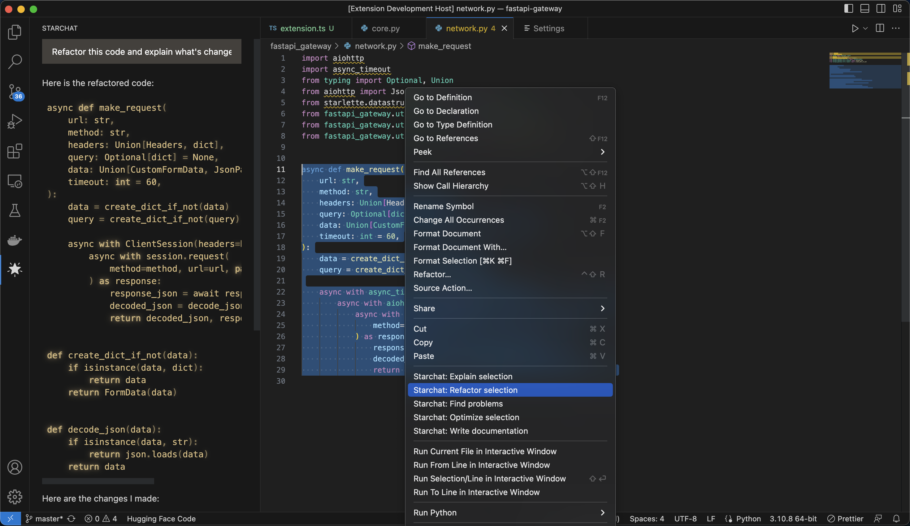

# HuggingFace's Starchat extension for VSCode

This Visual Studio Code extension allows you to use the [Starchat API](https://api-inference.huggingface.co/models/HuggingFaceH4/starchat-beta) to generate code or natural language responses to your coding questions, right within the editor.

Supercharge your coding with AI-powered assistance! Automatically write new code from scratch, ask questions, get explanations, refactor code, find bugs and more 🚀✨

 

## Features
- 🖱️ Right click on a code selection and run one of the context menu **shortcuts**
	- automatically write documentation for your code
	- explain the selected code
	- refactor or optimize it
	- find problems with it
- 💻 View Starchat's responses in a panel next to the editor
- 🚀 See the response as it is being generated **in real time**
- 💬 Ask **follow-up questions** to the response (conversation context is maintained)
- 📝 **Insert code snippets** from the AI's response into the active editor by clicking on them

## Setup

To use this extension, install it from the VSCode marketplace.

1. After the installation is complete, you will need to add your HuggingFace user access token to the extension settings in VSCode. To do this, open the `Settings` panel by going to the `File` menu and selecting `Preferences`, then `Settings`.
2. In the search bar, type `Starchat` to filter the settings list.
3. In the Starchat section, enter your API key in the top field

After completing these steps, the extension should be ready to use.

### Obtaining API key

To use this extension, you will need a user access token from HuggingFace. To obtain one, follow these steps:

1. Go to [HuggingFace's website](https://huggingface.co/settings/tokens). If you don't have an account, you will need to create one.
2. Click on the `New token` button to generate a new token.
3. Copy the token and paste it into the `API Key` field in the extension settings.

---

Please note that this extension is currently a proof of concept and may have some limitations or bugs. We welcome feedback and contributions to improve the extension.

## Credits

- This wouldn't be possible without OpenAI's [ChatGPT](https://chat.openai.com/chat)
- The extension makes use of [chatgpt-api](https://github.com/transitive-bullshit/chatgpt-api) (by [Travis Fischer](https://github.com/transitive-bullshit)), which uses unofficial ChatGPT API in order to login and communicate with it.
- The project was started by [mpociot](https://github.com/mpociot/)
- `v0.3` inspired by [barnesoir/chatgpt-vscode-plugin](https://github.com/barnesoir/chatgpt-vscode-plugin) and [gencay/vscode-chatgpt](https://github.com/gencay/vscode-chatgpt)